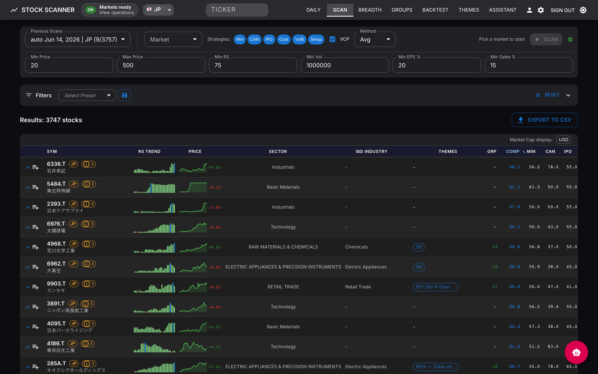
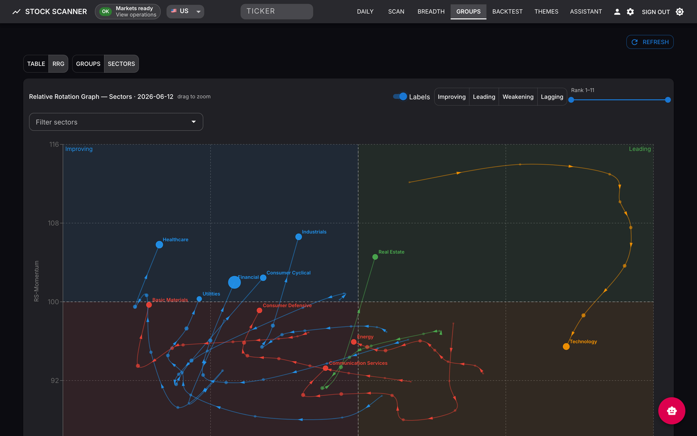

# Stock Screener 🇺🇸 🇨🇳 🇭🇰 🇯🇵 🇰🇷 🇹🇼 🇮🇳 🇩🇪 🇨🇦 🇸🇬 🇲🇾 🇦🇺

**Multi-market stock screening with multi-methodology scans, AI-assisted research, theme discovery, and real-time market breadth — across 12 markets.**

Scan and track **US, Hong Kong, India, Japan, Korea, Taiwan, mainland China A-shares, Germany, Canada, Singapore, Malaysia, and Australia**. Each market runs on its own exchange calendar and independent refresh queues, so regions hydrate in parallel without blocking each other. The supported deployment is a single-tenant server stack built on **Docker, PostgreSQL, Redis, and nginx**.


*Daily Snapshot → multi-screener Scan → drill into a stock's chart and scores → Market Breadth → Group Rankings with the Relative Rotation Graph*

## Try it without installing

A live read-only daily snapshot runs on GitHub Pages:
**[xang1234.github.io/stock-screener](https://xang1234.github.io/stock-screener/)**

This is a demo with reduced functionality compared to the server-backed app. See the **[Static Site Guide](docs/STATIC_SITE.md)** for exactly what works in static mode.

## Features

- **12-market coverage** — per-market exchange calendars, independent Celery refresh queues, and scan-time freshness guards; switch markets from the scan bar, with per-row colored badges on mixed-universe results.
- **6 screening methodologies** — Minervini, CANSLIM, IPO, Volume Breakthrough, Setup Engine, and Custom, run simultaneously with composite scoring across **80+ configurable filters**, saved presets, and CSV export.
- **Market breadth dashboard** — StockBee-style advance/decline analysis with a benchmark overlay, daily movers (±4%), and quarterly / monthly / 34-day trend windows.
- **197 IBD industry groups + RRG** — groups ranked by relative strength with movers (1W/1M/3M/6M) and constituent analysis, plus a MarketSmith/Bloomberg-style **Relative Rotation Graph** plotting RS-Ratio vs RS-Momentum through Leading → Weakening → Lagging → Improving.
- **Watchlists** — RS and price sparklines, multi-period change bars, drag-and-drop folders, and full-screen chart navigation.
- **AI research chatbot** — Groq-powered research with optional Tavily/Serper web search and persistent conversation history.
- **Theme discovery** — AI theme identification from RSS, Twitter/X, and news feeds; tracks trending vs. emerging themes and alerts on momentum shifts.
- **Operations & backtest** — server login, first-run market bootstrap, runtime status in the header, an Operations console for queues/jobs/telemetry, and a Backtest page that validates published scan picks and theme alerts against price history.


*Scan results: composite scores, RS sparklines, multi-screener ratings, and per-row GICS Sector / IBD Industry / theme / group-rank columns*


*RRG: sector rotation with direction-arrowed weekly tails; full 197-group scope available from the same view*

**Typical flow:** sign in → bootstrap markets → review the Daily dashboard → run a Scan → drill into a stock → monitor Operations → validate outcomes on Backtest. For the full page-by-page tour, see the **[Live App Guide](docs/LIVE_APP_GUIDE.md)**.

## Quickstart (Docker)

Deploys tagged GHCR images instead of building locally:

```bash
cp .env.docker.example .env.docker
# Edit .env.docker:
#   BACKEND_IMAGE=ghcr.io/<owner>/stockscreenclaude-backend
#   FRONTEND_IMAGE=ghcr.io/<owner>/stockscreenclaude-frontend
#   APP_IMAGE_TAG=v1.3.0
#   SERVER_AUTH_PASSWORD=choose-a-long-random-password
#   GROQ_API_KEY=...
ENABLED_MARKETS=US,HK,CN scripts/docker-compose-enabled-markets.sh --env-file .env.docker -f docker-compose.yml -f docker-compose.prod.yml -f docker-compose.release.yml pull
ENABLED_MARKETS=US,HK,CN scripts/docker-compose-enabled-markets.sh --env-file .env.docker -f docker-compose.yml -f docker-compose.prod.yml -f docker-compose.release.yml up -d --no-build
# Open http://localhost
```

On first launch the app opens to a **first-run bootstrap** screen — no pre-seeded database needed. Pick one primary market for startup defaults and optionally enable more to hydrate in the background, then start. Enabling many markets at once noticeably slows the first run, so start with one and add the rest after the workspace is ready.

- **Homelab / VPS / local-dev compose / GHCR options:** [Docker Deployment](docs/INSTALL_DOCKER.md)
- **Building from source:** [Development Guide](docs/DEVELOPMENT.md)
- **Bootstrap stages, stale/failure handling, re-runs:** [Operations Guide](docs/OPERATIONS.md)

## Configuration

Scanning and all core features work with **no API keys**. The AI chatbot requires at least one LLM provider key.

| Provider | Env Var | Free Tier | Notes |
|----------|---------|-----------|-------|
| Groq | `GROQ_API_KEY` | Yes | Default for chatbot and research |
| Gemini | `GEMINI_API_KEY` | Yes | Extraction fallback |
| Minimax | `MINIMAX_API_KEY` | No | Primary theme-extraction provider |
| Z.AI | `ZAI_API_KEY` | No | Optional alternate provider |

Optional web-search keys (`TAVILY_API_KEY`, `SERPER_API_KEY`) enable the chatbot's research mode. Full reference: **[Environment Variables](docs/ENVIRONMENT.md)**.

## Application pages

| Route | Page | Description |
|-------|------|-------------|
| `/` | Daily | Dashboard: Daily Snapshot, Key Markets, Themes, Watchlists, Stockbee MM |
| `/scan` | Bulk Scanner | Multi-market scanning with 80+ filters, per-market badges, CSV export |
| `/breadth` | Market Breadth | StockBee-style breadth indicators and trends |
| `/groups` | Group Rankings | IBD industry group rankings, movers, and the RRG |
| `/validation` | Backtest | Deterministic validation of scan picks and theme alerts |
| `/themes` | Themes | Feature-gated AI theme discovery, review queues, pipeline controls |
| `/chatbot` | Assistant | Feature-gated AI research assistant with web search and watchlist actions |
| `/stocks/:ticker` | Stock Detail | Charts, fundamentals, themes, watchlist actions, validation history |
| `/operations` | Operations | Runtime activity, queue/job inventory, telemetry alerts, safe job controls |

## Tech stack

**Backend:** FastAPI, SQLAlchemy, Alembic, Celery, Redis, PostgreSQL
**Frontend:** React 18, Vite, Material-UI, TanStack Query / Table, Recharts
**Data:** yfinance, Finviz, Alpha Vantage, SEC EDGAR, official X API (optional)

## Documentation

| Guide | Audience |
|-------|----------|
| [Live App Guide](docs/LIVE_APP_GUIDE.md) | Users of the server-backed live application |
| [Operations Guide](docs/OPERATIONS.md) | Live-app operators and maintainers |
| [Static Site Guide](docs/STATIC_SITE.md) | Static demo users and maintainers |
| [Docker Deployment](docs/INSTALL_DOCKER.md) | Server, homelab, VPS users |
| [Development Guide](docs/DEVELOPMENT.md) | Contributors, developers |
| [Architecture](docs/ARCHITECTURE.md) | Understanding the system design |
| [Environment Variables](docs/ENVIRONMENT.md) | Configuration reference |
| [MCP Integration](docs/MCP_INTEGRATION.md) | AI copilot workflows (12 tools via stdio / Streamable HTTP) |
| [Backend API & Architecture](backend/README.md) | Backend developers |
| [Frontend Components](frontend/README.md) | Frontend developers |
| [Contributing](CONTRIBUTING.md) | Getting started as a contributor |

## Disclaimer

This software is for educational and research purposes only. It is not financial advice. Always do your own research and consult a licensed financial advisor before making investment decisions.

## License

Released under the [Apache License 2.0](LICENSE).
