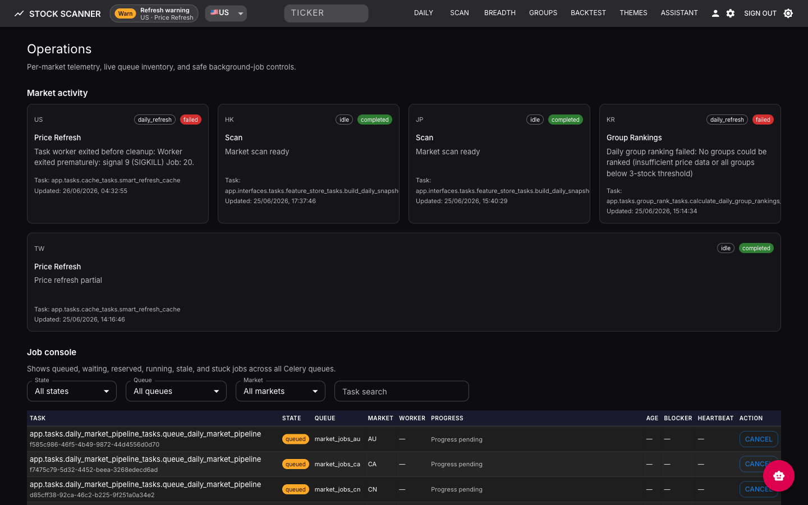
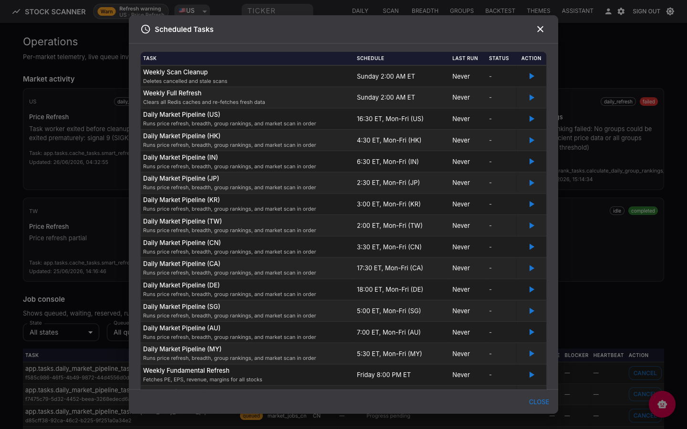

# Operations Guide

This guide covers live runtime operations for the server-backed app: starting and stopping the stack, first-run bootstrap, resetting to a clean bootstrap, enabled-market workers, runtime activity, job controls, telemetry, scheduled tasks, and common recovery paths.

## Runtime Model

The live app stores runtime choices in PostgreSQL and runs market work through Redis/Celery queues.

- `runtime.primary_market` controls the market opened first and used for startup defaults.
- `runtime.enabled_markets` controls which markets the app should hydrate and expose.
- `runtime.bootstrap_state` moves from `not_started` to `running` to `ready`.
- Runtime activity rows report per-market lifecycle, stage, progress, owner task, and warning/failure state.

The UI surfaces this through the header status chip and `/operations`.

## Starting the Stack

All start/stop goes through `scripts/docker-compose-enabled-markets.sh` — a thin wrapper around `docker compose` that derives the right Compose **profiles** from `ENABLED_MARKETS` and forwards every other argument unchanged.

**Prerequisites:** Docker (with Compose v2), Python 3.11+ on `PATH` (the wrapper uses it to compute profiles), and a `.env` (or `.env.docker`) holding at least `SERVER_AUTH_PASSWORD` and `ENABLED_MARKETS`.

```bash
# Start (detached), enabling US + four Asian markets
ENABLED_MARKETS=US,HK,JP,TW,KR scripts/docker-compose-enabled-markets.sh up -d

# Foreground (watch logs); Ctrl-C stops
ENABLED_MARKETS=US,HK,JP,TW,KR scripts/docker-compose-enabled-markets.sh up

# Stop and remove containers
ENABLED_MARKETS=US,HK,JP,TW,KR scripts/docker-compose-enabled-markets.sh down
```

Open the app at the deployment URL and sign in with `SERVER_AUTH_PASSWORD`. The wrapper prints the resolved `ENABLED_MARKETS` and `COMPOSE_PROFILES` before running.

### Options

| Capability | How |
|------------|-----|
| Select market workers | `ENABLED_MARKETS=US,HK,JP,TW,KR` as an env var, or set it in `.env` / `.env.docker`. Default: `US`. |
| Any Compose subcommand | Forwarded verbatim: `up`, `up -d`, `down`, `pull`, `ps`, `logs -f`, `restart <service>`. |
| Compose overlays | Append `-f docker-compose.yml -f docker-compose.prod.yml …` for prod/HTTPS/release layers. |
| Env file | Auto-uses `.env`, then `.env.docker`; override with `--env-file <path>`. |
| Extra profiles | `COMPOSE_PROFILES=…` is merged with the derived market profiles. |
| Python interpreter | Pin with `STOCKSCREEN_PYTHON=/path/to/python3.11+` if the default isn't 3.11+. |

### Selecting enabled markets

The base Compose file defines workers for every supported market, but market-specific workers sit behind Compose profiles. The wrapper starts only the profiles required by `ENABLED_MARKETS`.

For `ENABLED_MARKETS=US,HK,JP,TW,KR`, Docker starts the US/HK/JP/TW/KR market-job and user-scan workers; CN/IN/DE/CA/SG/MY/AU containers are not created, and the global data-fetch worker listens only to those markets' `data_fetch_*` queues.

Keep the first-run wizard's enabled markets within the deployment `ENABLED_MARKETS` set. To add a market later, update `ENABLED_MARKETS` and recreate:

```bash
ENABLED_MARKETS=US,HK,JP,TW,KR,CN scripts/docker-compose-enabled-markets.sh up -d
```

> **Note:** `down` always tears down **all** market profiles (not just the enabled ones) and auto-adds `--remove-orphans`, so it fully stops the stack regardless of the `ENABLED_MARKETS` value on that line.

## First-Run Bootstrap

On a fresh (empty) database the app opens to the first-run wizard. Choose a primary market and any secondary markets to hydrate in the background. The workspace opens when the primary market is ready; secondary markets continue on their own queues.

| | |
|---|---|
|  |  |
| *Primary-market picker* | *Staged hydration progress* |

Bootstrap stages:

1. **Universe refresh** — seeds the market symbol list. US uses S&P 500 / Russell / NDX via `refresh_stock_universe`; HK / IN / JP / KR / TW / CN / CA / DE / SG / MY / AU use official exchange feeds via `refresh_official_market_universe`.
2. **Benchmark + price refresh** — imports the GitHub daily price bundle first, accepts recent stale bundles during bootstrap, then live-fetches missing/current-session gaps (`7d` top-up for stale symbols, `2y` for no-history symbols).
3. **Fundamentals refresh** — loads quarterly and annual financials.
4. **Breadth calculation** — computes StockBee-style advance/decline data with gap-fill.
5. **Group rankings** — computes IBD-style relative strength group ranks.
6. **Feature snapshot** — US-only daily feature rollup for the Setup Engine.
7. **Initial autoscan** — publishes the first default-profile scan.

Selecting many enabled markets multiplies this work. On smaller hosts, start with one primary market and add markets after the workspace is ready.

## Reset to a Clean Bootstrap

To re-run the first-run wizard from scratch (e.g. corrupt state, schema reset, or a clean demo), stop the stack, clear DB/cache/scheduler state, and start again. The Postgres directory is **moved, not deleted**, so the reset is reversible.

```bash
# 1. Stop the stack
ENABLED_MARKETS=US,HK,JP,TW,KR scripts/docker-compose-enabled-markets.sh down

# 2. Preserve the current DB → forces an empty one (this is what re-triggers bootstrap)
mv docker-data/postgres docker-data/postgres.saved.$(date +%Y%m%d_%H%M%S)

# 3. Drop the Redis volume (Celery broker + results + app cache)
docker volume rm $(docker volume ls -q | grep '_redis_data$')

# 4. Reset the Celery Beat schedule
rm -f data/celerybeat-schedule

# 5. Start again — the app opens to the first-run wizard
ENABLED_MARKETS=US,HK,JP,TW,KR scripts/docker-compose-enabled-markets.sh up
```

| Step | Effect |
|------|--------|
| `down` | Stops all containers (and orphans). |
| `mv docker-data/postgres …saved.<timestamp>` | Empties the live DB while keeping a timestamped backup (e.g. `postgres.saved.20260624_110650`). |
| `docker volume rm …_redis_data` | Clears the Celery broker/results and the application cache. |
| `rm -f data/celerybeat-schedule` | Forces the scheduler to rebuild its run state. |
| `up` | Boots into first-run bootstrap; watch progress on `/operations`. |

> **Warning:** steps 2–4 wipe the live database, cache, and scheduler state, and step 5 re-hydrates **every** enabled market — heavy on large `ENABLED_MARKETS` sets. The data loss is recoverable only from the moved Postgres directory (and any external backups).

**Roll back** to the pre-reset database:

```bash
ENABLED_MARKETS=US,HK,JP,TW,KR scripts/docker-compose-enabled-markets.sh down
rm -rf docker-data/postgres                                   # discard the fresh bootstrap DB
mv docker-data/postgres.saved.<timestamp> docker-data/postgres
ENABLED_MARKETS=US,HK,JP,TW,KR scripts/docker-compose-enabled-markets.sh up -d
```

## Runtime Activity

The header chip summarizes runtime state:

- **OK** — all markets are idle or ready.
- **Sync / percent** — bootstrap is running.
- **count** — one or more markets have active work.
- **Warn** — a market is stale, stuck, failed, or runtime activity cannot be checked.

Click the chip to open `/operations`.

## Operations Page


*Operations — per-market activity (states, messages, timestamps) above the filterable job console*

The Operations page includes:

- **Market activity** — per-market lifecycle, stage, message, task name, progress, and updated time.
- **Telemetry alerts** — warning/critical alerts with acknowledge controls.
- **Market health summaries** — freshness lag, benchmark age, universe drift, and completeness distribution.
- **Job console** — queued, waiting, reserved, running, stale, stuck, failed, and cancelled jobs across Celery queues.
- **Lease view** — current external-fetch and market-workload ownership.
- **Safe cancellation controls** — revoke, scan cancel, force refresh cancel, or queue removal when the backend marks an action as supported.

Use the filters (state, queue, market, task text) to narrow the job console before cancelling anything.

## Scheduled Tasks

When the tasks feature is enabled, the header settings icon opens **Scheduled Tasks**.


*Scheduled Tasks — registered jobs with schedule, last-run, status, and run-now*

The dialog shows each task's display name and description, schedule, last run time and duration, last status, and a run-now action (with polling while a task is active). Tasks are feature-gated; deployments without task support do not show this control.

## Common Recovery Paths

### Bootstrap Is Slow

- Check `/operations` for active market stages and queue ownership.
- Confirm the host has workers for every market selected in the wizard.
- Reduce enabled markets and restart the stack if the host is resource constrained.
- Check upstream data-provider throttling if many symbols are stuck in price/fundamental refresh.

### Scan Is Blocked

Scans can return a market-refresh blocker while a selected market is hydrating. Wait for the relevant market to leave active refresh state, or inspect `/operations` for stale/stuck work.

### Runtime Activity Looks Stale

Use `/operations` to confirm whether a live worker owns the task. If no worker owns stale running work, restart the affected worker profile and re-run the market refresh or bootstrap step.

### Job Cancellation Fails

Cancellation is intentionally conservative. If a job has no supported cancel strategy, inspect the queue/worker state first, then restart only the affected worker profile if necessary.

### Bootstrap Won't Re-Trigger

The wizard only appears on an empty database. If a stale DB persists, confirm `docker-data/postgres` was moved/emptied (see [Reset to a Clean Bootstrap](#reset-to-a-clean-bootstrap)) before restarting.

### API Docs Are Missing

Interactive API docs are disabled by default in server deployments. Set `SERVER_EXPOSE_API_DOCS=true` only for trusted local development or private environments.

## Related Docs

- [Live App Guide](LIVE_APP_GUIDE.md)
- [Docker Deployment](INSTALL_DOCKER.md)
- [Environment Variables](ENVIRONMENT.md)
- [Architecture](ARCHITECTURE.md)
